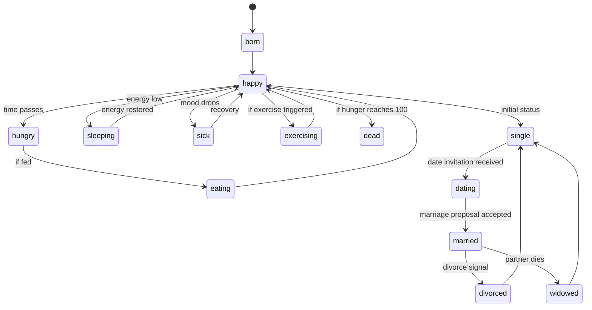
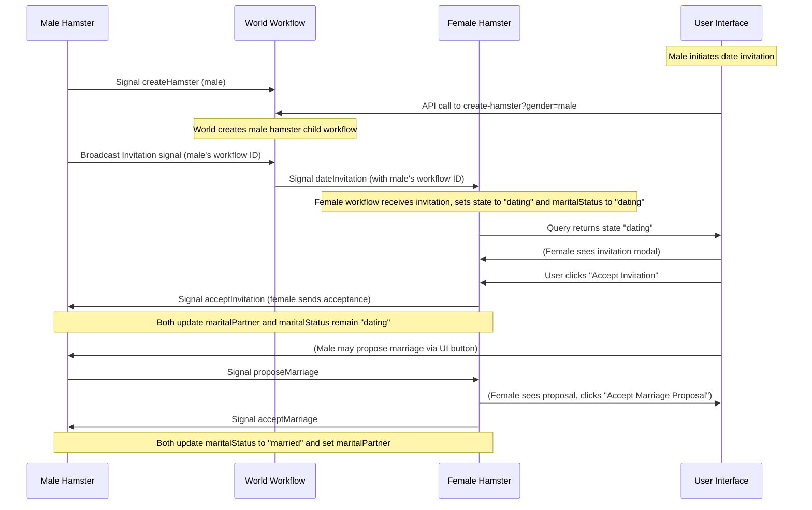

# Hamster Simulator

A Next.js project that uses Temporal workflows to simulate a hamster's life—including daily activities and complex marital/dating interactions. This simulation includes a rich state machine for day-to-day activities (e.g. "happy", "hungry", "eating", "sleeping") and an extended marital state machine (e.g. "single", "dating", "married", "divorced", "widowed").

## Table of Contents

- [Overview](#overview)
- [Project Structure](#project-structure)
- [Workflows & Business Logic](#workflows--business-logic)
  - [Hamster Workflow](#hamster-workflow)
  - [World Workflow](#world-workflow)
- [API Endpoints](#api-endpoints)
- [Mermaid Diagrams](#mermaid-diagrams)
  - [Hamster State & Marital Status Diagram](#hamster-state--marital-status-diagram)
  - [Sequence Diagram for Dating & Marriage Flow](#sequence-diagram-for-dating--marriage-flow)
- [Setup and Running](#setup-and-running)
- [Notes](#notes)

## Overview

The **Hamster Simulator** is built with Next.js, TypeScript, and Temporal workflows. The application simulates the lifecycle of a hamster, including:

- **Daily Life:** The hamster transitions through states such as "born", "happy", "hungry", "eating", "sleeping", "sick", "exercising", and eventually "dead". These transitions are driven by activities (e.g., feeding, playing) via Temporal workflows.
- **Marital Interactions:** Hamsters have an extended marital state machine with statuses:  
  - **Single**: The default state.
  - **Dating**: When a female receives a date invitation from a male.
  - **Married**: When both partners accept a marriage proposal.
  - **Divorced**: When either partner signals divorce.
  - **Widowed**: When a married partner dies.
  
A central **world workflow** spawns child hamster workflows (for both male and female hamsters) in a deterministic manner and maintains lists of registered hamsters. The system supports signals and queries to interact with the workflows and update the hamster’s state in real time.

## Project Structure

```
hamster_simulator/
├── README.md
├── activities/
│   └── hamsterActivities.ts
├── eslint.config.mjs
├── next-env.d.ts
├── next.config.ts
├── package-lock.json
├── package.json
├── public/
│   ├── file.svg
│   ├── globe.svg
│   ├── next.svg
│   ├── vercel.svg
│   └── window.svg
├── src/
│   ├── app/
│   │   ├── favicon.ico
│   │   ├── globals.css
│   │   ├── layout.tsx
│   │   ├── page.module.css
│   │   └── page.tsx
│   ├── lib/
│   │   └── hamsterService.ts
│   └── pages/
│       └── api/
│           ├── broadcast-date.ts
│           ├── create-hamster.ts
│           ├── hamster-stats.ts
│           ├── signal-hamster.ts
│           └── start-hamster.ts
├── start-world.ts
├── tsconfig.json
├── worker.ts
├── workflows/
│   ├── hamsterWorkflow.ts
│   ├── index.ts
│   └── worldWorkflow.ts
└── your_temporal.db
```

## Workflows & Business Logic

### Hamster Workflow

The hamster workflow simulates the hamster's day-to-day life and marital interactions. It manages:

- **Daily States:** `"born"`, `"happy"`, `"hungry"`, `"eating"`, `"sleeping"`, `"sick"`, `"exercising"`, `"dead"`.
- **Marital Status:** `"single"`, `"dating"`, `"proposalSent"`, `"proposalReceived"`, `"married"`, `"divorced"`, `"widowed"`.
- **Signals:**  
  - **Daily Actions:** `feedSignal`, `playSignal`, `sleepSignal`, `petSignal`, `exerciseSignal`, `killSignal`.
  - **Dating/Marriage:**  
    - `dateInvitationSignal`: A male sends an invitation to a female.  
    - `acceptInvitationSignal`: The female accepts the invitation.  
    - `proposeMarriageSignal`: Either partner proposes marriage.  
    - `marriageProposalReceivedSignal`: The recipient of a proposal receives this signal.  
    - `acceptMarriageSignal`: The recipient accepts the marriage proposal.  
    - `divorceSignal`: Either partner can divorce.  
    - `becomeWidowedSignal`: If a partner dies, the surviving partner becomes widowed.

### World Workflow

The world workflow is the parent that creates child hamster workflows. It:
- Uses a deterministic counter to generate child workflow IDs.
- Maintains two lists: one for female hamster workflows and one for male hamster workflows.
- Exposes a signal (`createHamsterSignal`) to spawn a new hamster and a query (`getWorldStateQuery`) to retrieve current state.

## API Endpoints

- **broadcast-date.ts:**  
  Called by a male to broadcast a date invitation to all registered female hamster workflows.

- **create-hamster.ts:**  
  Signals the world workflow to create a new hamster workflow and returns the new child’s workflow ID.

- **hamster-stats.ts:**  
  Queries a specific hamster workflow for its current stats.

- **signal-hamster.ts:**  
  A generic endpoint for sending signals to a specific hamster workflow. It now supports the new signals: `"acceptInvitation"`, `"proposeMarriage"`, `"acceptMarriage"`, `"divorce"`, etc.

## Mermaid Diagrams

### Hamster State & Marital Status Diagram



### Sequence Diagram for Dating & Marriage Flow



## Setup and Running

1. **Install Dependencies:**  
   Run:
   ```bash
   npm install
   ```
2. **Start Temporal Server (if not already running):**  
   Use:
   ```bash
   temporal server start-dev --db-filename your_temporal.db --ui-port 8080
   ```
3. **Start the World Workflow:**  
   Run the `start-world.ts` script:
   ```bash
   npx ts-node --esm start-world.ts
   ```
4. **Start the Worker:**  
   Run:
   ```bash
   npx ts-node --esm worker.ts
   ```
5. **Run the Next.js App:**  
   Start your Next.js development server:
   ```bash
   npm run dev
   ```

## Notes

- The UI (in `src/app/page.tsx`) polls for hamster stats and displays daily and marital states.
- The API endpoints under `src/pages/api` allow for creating hamsters, signaling workflows, and broadcasting date invitations.
- The workflows and APIs use Temporal’s TypeScript SDK to manage deterministic state transitions.
- The provided Mermaid diagrams illustrate the core state transitions for daily life and marital interactions, and the sequence of messages between a male and female hamster during the dating/marriage flow.
- This README provides context for troubleshooting, extending functionality, or discussing improvements.

Feel free to adjust this README to better fit your project or to add additional sections as needed.