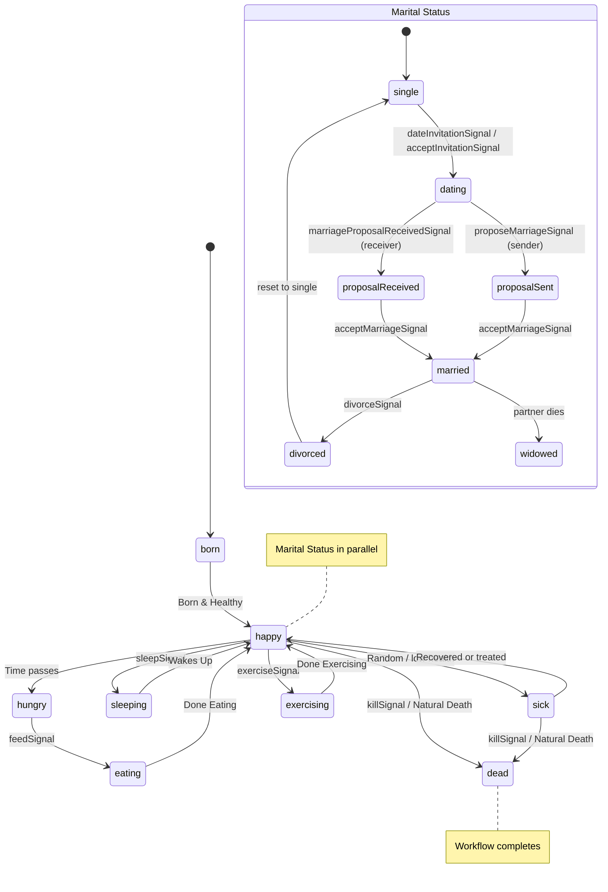
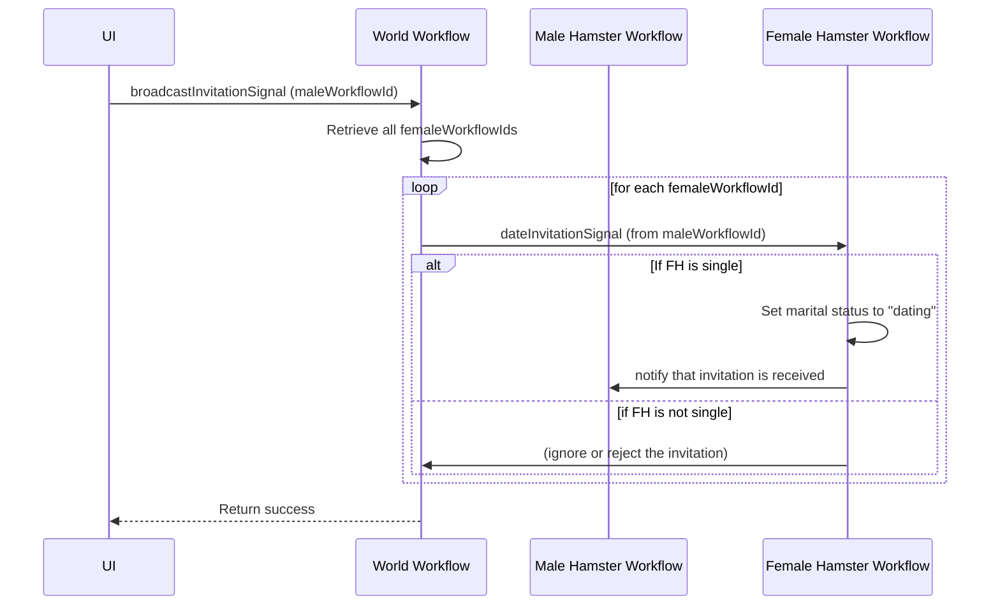
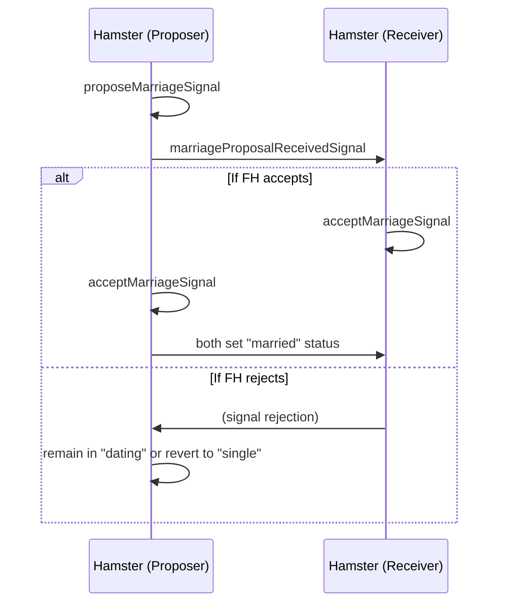

```markdown
# Hamster Simulator

Welcome to **Hamster Simulator**, a demonstration project that simulates the day-to-day life of a hamster, including dating and marriage mechanics, powered by [Temporal](https://temporal.io/) and [Next.js](https://nextjs.org/). This project is written in TypeScript, uses ESM with `ts-node` for development, and demonstrates advanced workflow concepts with signals and queries.

---

## Table of Contents

1. [Project Overview](#project-overview)
2. [Tech Stack](#tech-stack)
3. [Features](#features)
4. [Project Structure](#project-structure)
5. [Workflows](#workflows)
   - [Hamster Workflow](#hamster-workflow)
   - [World Workflow](#world-workflow)
6. [Activities](#activities)
7. [API Endpoints](#api-endpoints)
8. [Running the Project](#running-the-project)
9. [Usage & Examples](#usage--examples)
10. [State Diagrams](#state-diagrams)
11. [Sequence Diagrams](#sequence-diagrams)
12. [License](#license)

---

## Project Overview

**Hamster Simulator** is a fun and educational way to explore Temporal’s workflow and activity model. The application uses Temporal’s TypeScript SDK to manage the lifecycle of “hamsters” in a virtual world:

- Each hamster has a daily routine: born, eating, sleeping, exercising, and can eventually die.
- Hamsters can form relationships, date, propose marriage, accept/reject proposals, divorce, and become widowed.
- A “world workflow” oversees the creation of new hamsters and coordinates date invitations.

---

## Tech Stack

- **Next.js** (using the App Router): Front-end & API routes.
- **TypeScript**: Strict type checking and modern JavaScript features.
- **Temporal.io**: Manages long-running and reliable workflows.
- **ts-node** with ESM**: For local development convenience.
- **ESLint**: For code consistency and best practices.

---

## Features

1. **Hamster Lifecycle**: Uses a single workflow (`hamsterWorkflow`) to handle day-to-day hamster states, signals for daily actions (feed, sleep, etc.), and advanced relationship signals (date invitations, marriage proposals, divorce, etc.).
2. **World Management**: A master workflow (`worldWorkflow`) creates child workflows (one per hamster), tracks male and female hamster IDs, and broadcasts invitations.
3. **Activities**: Offload non-deterministic logic (like updating hamster stats or calculating age) to activity functions.
4. **APIs & UI**: Expose REST endpoints (in `src/pages/api`) to control and observe hamsters. The Next.js front-end provides a simple UI to create hamsters, signal them, and see real-time statuses.

---

## Project Structure

Below is an outline of the folder structure (excluding `node_modules`):

```
.
├── README.md
├── activities
│   └── hamsterActivities.ts
├── eslint.config.mjs
├── next-env.d.ts
├── next.config.ts
├── package-lock.json
├── package.json
├── public
│   ├── file.svg
│   ├── globe.svg
│   ├── next.svg
│   ├── vercel.svg
│   └── window.svg
├── src
│   ├── app
│   │   ├── favicon.ico
│   │   ├── globals.css
│   │   ├── layout.tsx
│   │   ├── page.module.css
│   │   └── page.tsx
│   ├── lib
│   │   └── hamsterService.ts
│   └── pages
│       └── api
│           ├── broadcast-date.ts
│           ├── create-hamster.ts
│           ├── hamster-stats.ts
│           ├── signal-hamster.ts
│           └── start-hamster.ts
├── start-world.ts
├── tsconfig.json
├── worker.ts
├── workflows
│   ├── hamsterWorkflow.ts
│   ├── index.ts
│   └── worldWorkflow.ts
└── your_temporal.db
```

### Key Files

- **`workflows/hamsterWorkflow.ts`**: Child workflow handling a single hamster’s lifecycle.
- **`workflows/worldWorkflow.ts`**: Parent workflow managing creation of hamsters and broadcasting signals.
- **`activities/hamsterActivities.ts`**: Contains non-deterministic logic (e.g., `updateStats`).
- **`src/pages/api/...`**: REST endpoints to interact with the workflows.
- **`worker.ts`**: Temporal worker registering the workflows and activities.
- **`start-world.ts`**: Script to start or connect to the “world” workflow.

---

## Workflows

### Hamster Workflow

1. **Daily States**:
   - `born`
   - `happy`
   - `hungry`
   - `eating`
   - `sleeping`
   - `sick`
   - `exercising`
   - `dead`

2. **Marital Status**:
   - `single`
   - `dating`
   - `proposalSent`
   - `proposalReceived`
   - `married`
   - `divorced`
   - `widowed`

3. **Signals**:
   - **Daily Actions**:
     - `feedSignal`
     - `playSignal`
     - `sleepSignal`
     - `petSignal`
     - `exerciseSignal`
     - `killSignal`

   - **Dating/Marriage**:
     - `dateInvitationSignal` (male to female)
     - `acceptInvitationSignal` (female to male)
     - `proposeMarriageSignal`
     - `marriageProposalReceivedSignal`
     - `acceptMarriageSignal`
     - `divorceSignal`
     - `becomeWidowedSignal`

### World Workflow

- Manages child hamster workflows.
- Keeps track of `nextChildId` to assign unique IDs to each new hamster.
- Maintains two lists of workflow IDs: one for males, one for females.
- Signals:
  - `createHamsterSignal` to spawn a new hamster workflow.
  - `broadcastInvitationSignal` for a male to invite all registered females to date.
- Query:
  - `getWorldStateQuery` returns current lists of hamster IDs and the `nextChildId`.

---

## Activities

Inside `activities/hamsterActivities.ts`:

- **`updateStats`**: Simulates the passage of time, updating hamster attributes like age, hunger level, health, mood, etc. Activities must remain deterministic from the workflow’s point of view, so external I/O should be properly wrapped or avoided unless absolutely necessary.

---

## API Endpoints

Located under `src/pages/api`:

1. **`broadcast-date.ts`**  
   - Called by a male hamster to broadcast date invitations to all registered females.
   - Internally signals the `worldWorkflow` to get the list of female hamster IDs, then sends each a `dateInvitationSignal`.

2. **`create-hamster.ts`**  
   - Signals the `worldWorkflow` to create a new hamster.
   - Returns the newly created hamster workflow ID.

3. **`hamster-stats.ts`**  
   - Queries a specific hamster workflow for its stats (daily state, marital status, partner ID, etc.).

4. **`signal-hamster.ts`**  
   - A generic endpoint to send signals to a specific hamster workflow.
   - Supports daily actions (`feedSignal`, `playSignal`, etc.) and relationship actions (`dateInvitationSignal`, `acceptMarriageSignal`, etc.).

5. **`start-hamster.ts`**  
   - Can be used to “boot up” a hamster if needed or to ensure a hamster workflow is running.

---

## Running the Project

1. **Install Dependencies**:
   ```bash
   npm install
   ```

2. **Run Temporal Server**:  
   You can run the Temporal Server locally via Docker or any other setup. Make sure the server is running before starting the worker.

3. **Start the Worker**:
   ```bash
   npm run worker
   ```
   This will compile and register the workflows and activities with the Temporal server.

4. **Start the World Workflow**:
   ```bash
   npm run start-world
   ```
   This script checks if the “world” workflow (ID: `world`) is already running; if not, it starts it.

5. **Run the Next.js Server**:
   ```bash
   npm run dev
   ```
   Access the UI at `http://localhost:3000`.

---

## Usage & Examples

- **Create a Hamster**: Select a gender in the UI and click “Create Hamster.” A child workflow is started in Temporal, and you’ll see the hamster’s stats appear.
- **Daily Actions**: Click buttons like “Feed,” “Play,” “Sleep” in the UI to send signals to the hamster workflow.
- **Broadcast Invitations**: If you have a male hamster, use “Broadcast Invitation” to invite any female hamsters. If a female is single, she moves to “dating,” and the male can then propose, etc.
- **Marriage**:
  - Male can send `proposeMarriageSignal`.
  - Female receives a `marriageProposalReceivedSignal`.
  - If accepted (`acceptMarriageSignal`), both hamsters become “married.”
- **Divorce**: The “divorce” action sets both partners to “divorced” or “single.”
- **Death**: The “kill” button signals the hamster to die, triggering the surviving partner’s “widowed” state if they were married.

---

## State Diagrams

### Hamster Workflow States (Daily States + Marital Status)



- This diagram shows daily states such as `born`, `happy`, `hungry`, etc., and parallel marital states such as `single`, `dating`, and `married`.  
- A hamster can “die” (via `dead`), which completes the workflow. If a partner hamster is still alive, they receive a `becomeWidowedSignal`.

---

## Sequence Diagrams

### Dating Invitation Sequence (Broadcast)



### Marriage Proposal Sequence



---

## License

This project is provided as-is for educational and demonstration purposes.

---

> **Note**: This README provides an overview and diagrams. Please consult the actual code (workflows, activities, and API endpoints) for the most up-to-date and detailed implementation logic. Feel free to submit pull requests, open issues, or suggest improvements.

Enjoy the **Hamster Simulator**!
```